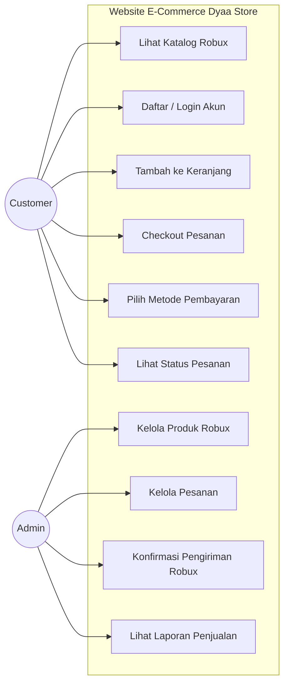
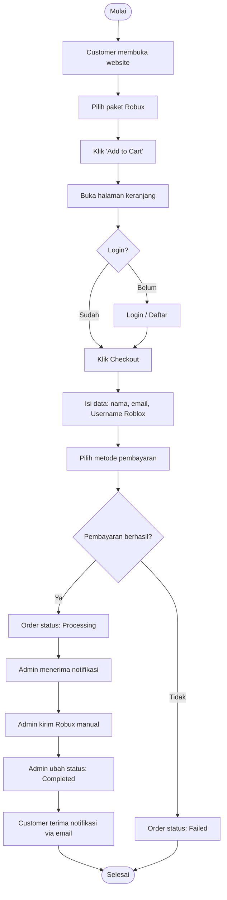
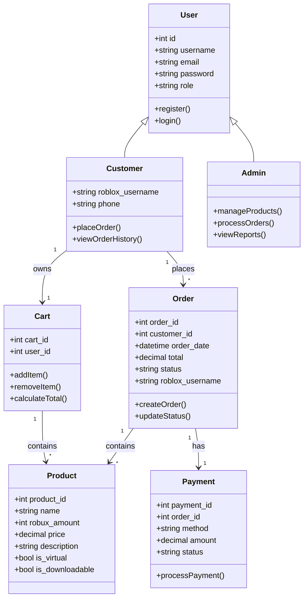
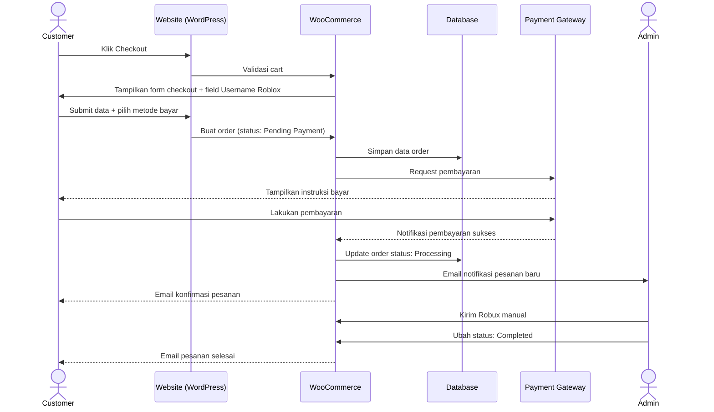

# Perancangan Sistem (UML) — Dyaa Store E-Commerce

> Acuan: Skripsi Bab 2.4.2 (UML) & Bab 3.1.3 (Perancangan)
> Diagram menggunakan **Mermaid** (dapat dirender langsung di GitHub/VS Code)

## 1. Use Case Diagram



### Skenario Use Case Utama

#### UC-04: Checkout Pesanan
- **Aktor**: Customer
- **Pre-condition**: Customer sudah login dan memiliki item di keranjang
- **Main Flow**:
  1. Customer klik tombol "Checkout"
  2. Sistem menampilkan form data pengiriman (termasuk Username Roblox)
  3. Customer mengisi data dan memilih metode pembayaran
  4. Sistem menghitung total dan menampilkan ringkasan
  5. Customer konfirmasi pesanan
  6. Sistem mencatat order dengan status "Pending Payment"
- **Post-condition**: Order tercatat dan Customer diarahkan ke instruksi pembayaran

---

## 2. Activity Diagram — Alur Pembelian Robux



---

## 3. Class Diagram (Konseptual berbasis WooCommerce)



---

## 4. Sequence Diagram — Proses Checkout



---

## 5. Struktur Navigasi Website

```
Beranda (/)
├── Shop / Katalog Robux (/shop)
│   └── Detail Produk (/product/{slug})
├── Keranjang (/cart)
├── Checkout (/checkout)
├── Akun Saya (/my-account)
│   ├── Riwayat Pesanan
│   └── Edit Profil
├── Cara Pesan / FAQ (/cara-pesan)
└── Kontak (/kontak)

Admin Dashboard (/wp-admin)
├── Dashboard
├── WooCommerce → Pesanan
├── Produk
└── Laporan
```

---

## 6. Wireframe Tekstual

### 6.1 Halaman Beranda
```
┌─────────────────────────────────────────────┐
│  [Logo Dyaa Store]    Menu: Home Shop FAQ   │
├─────────────────────────────────────────────┤
│                                             │
│   HERO: "Top Up Robux Termurah & Tercepat"  │
│         [Tombol: Belanja Sekarang]          │
│                                             │
├─────────────────────────────────────────────┤
│   PAKET POPULER                             │
│   ┌──────┐  ┌──────┐  ┌──────┐  ┌──────┐    │
│   │ 80 R │  │ 400R │  │ 800R │  │ 1700 │    │
│   │ Rp14k│  │ Rp65k│  │ Rp130│  │ Rp275│    │
│   └──────┘  └──────┘  └──────┘  └──────┘    │
├─────────────────────────────────────────────┤
│   CARA PESAN (3 step icon)                  │
├─────────────────────────────────────────────┤
│   FOOTER: Kontak | FAQ | Sosial Media       │
└─────────────────────────────────────────────┘
```

### 6.2 Halaman Checkout
```
┌─────────────────────────────────────────────┐
│  Detail Pemesan          | Ringkasan Pesanan│
│  ─────────────────       | ───────────────  │
│  Nama Lengkap: [____]    | 400 Robux  x1    │
│  Email: [____]           | Subtotal: 65.000 │
│  No. HP: [____]          | Total:    65.000 │
│  Username Roblox: [____] |                  │
│                          | Metode Bayar:    │
│  ─────────────────       | ( ) E-Wallet    │
│                          | ( ) VA          │
│                          | ( ) Transfer     │
│                          |                  │
│                          | [Bayar Sekarang] │
└─────────────────────────────────────────────┘
```
