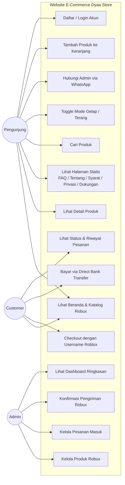
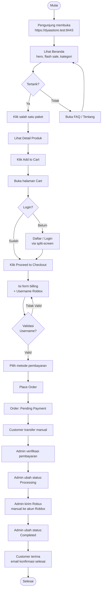
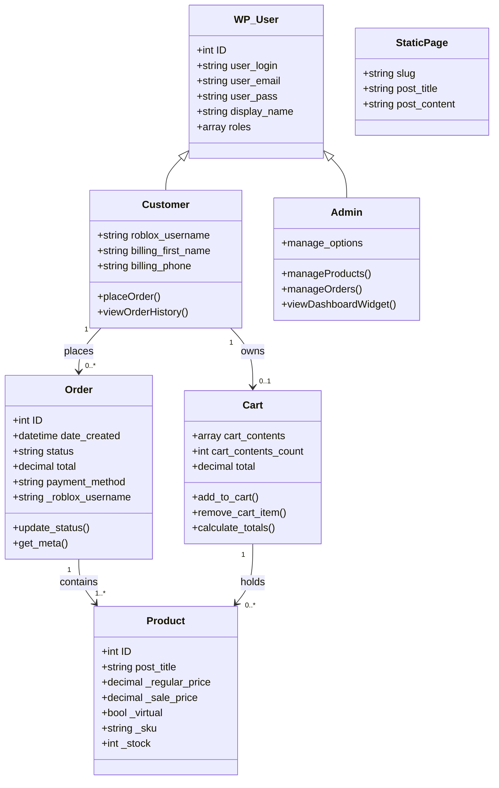
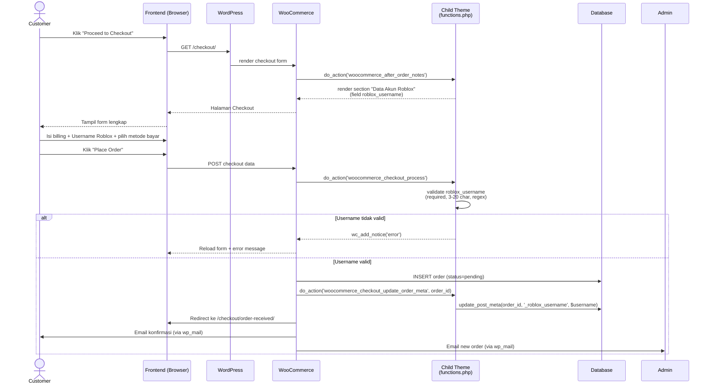
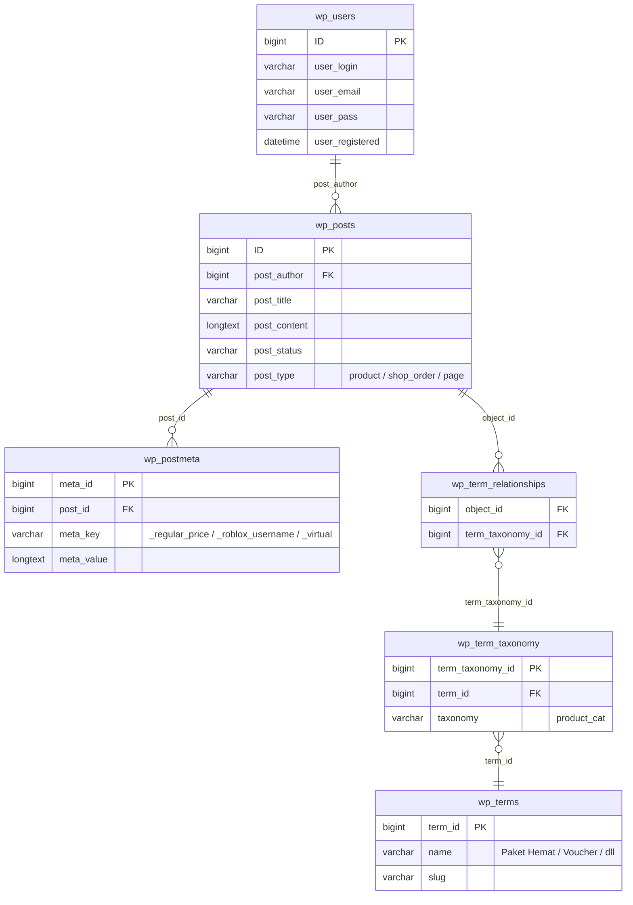

# Perancangan Sistem (UML) — Dyaa Store E-Commerce

> **Acuan Skripsi**: BAB II §2.4.2 (UML) & BAB III §3.1.3 (Perancangan)
> **Tujuan**: rancangan ini dipakai sebagai *blueprint* di **BAB IV** (Implementasi & Evaluasi).
> Diagram berformat **Mermaid** sehingga dapat dirender langsung di GitHub / VS Code.

> **Catatan**: kode aktor pada use case di bawah mengikuti `docs/01-analisis-kebutuhan.md`.

---

## 1. Use Case Diagram

Tiga aktor: **Pengunjung** (belum login), **Customer** (terdaftar), dan **Admin** (pemilik toko).



### Skenario Use Case Utama

#### UC-09: Checkout dengan Username Roblox

| Aspek | Detail |
|---|---|
| **ID Use Case** | UC-09 |
| **Aktor Utama** | Customer |
| **Pre-condition** | Customer sudah login dan keranjang tidak kosong |
| **Post-condition** | Order tercatat di sistem dengan status *Pending Payment* dan field `_roblox_username` tersimpan di order meta |

**Main Flow**:
1. Customer klik tombol **Proceed to Checkout** dari halaman keranjang.
2. Sistem menampilkan form Checkout WooCommerce + section custom **"Data Akun Roblox"**.
3. Customer mengisi data billing dan **Username Roblox** (3–20 karakter alfanumerik+underscore).
4. Customer memilih metode pembayaran (Direct Bank Transfer / lainnya bila aktif).
5. Customer klik **Place Order**.
6. Sistem memvalidasi field Username Roblox (lihat `dyaastore_validate_roblox_field()`).
7. Sistem membuat order baru dengan status *Pending Payment*, menyimpan Username Roblox di `_roblox_username`.
8. Sistem mengarahkan customer ke halaman **Thank You** dan mengirim email konfirmasi.

**Alternative Flow A — Username Roblox kosong**
- Pada langkah 6, sistem menampilkan notice error "Username Roblox wajib diisi untuk pengiriman Robux." dan kembali ke form.

**Alternative Flow B — Username Roblox tidak valid**
- Pada langkah 6, sistem menampilkan notice "Username Roblox harus 3–20 karakter." atau "Username Roblox hanya boleh huruf, angka, dan underscore." sesuai pelanggaran.

---

#### UC-13: Kelola Pesanan Masuk

| Aspek | Detail |
|---|---|
| **ID Use Case** | UC-13 |
| **Aktor Utama** | Admin |
| **Pre-condition** | Admin login ke `/wp-admin` |
| **Post-condition** | Status order ter-update; customer menerima email otomatis |

**Main Flow**:
1. Admin masuk ke menu **WooCommerce → Orders**.
2. Sistem menampilkan tabel order dengan kolom tambahan **Username Roblox** (lihat `dyaastore_orders_column()`).
3. Admin klik salah satu order untuk melihat detail.
4. Sistem menampilkan ringkasan order, alamat billing, dan **Username Roblox** di sidebar order (di bawah billing address).
5. Admin mengirim Robux secara manual ke akun Roblox sesuai username.
6. Admin mengubah status order ke **Completed**.
7. Sistem otomatis mengirim email pemberitahuan order selesai ke customer.

---

## 2. Activity Diagram — Alur Pembelian Robux End-to-End



---

## 3. Class Diagram (Konseptual berbasis WooCommerce)



> **Catatan implementasi**: Field `_roblox_username` adalah **post meta** pada object `Order` (bukan kolom tabel terpisah). Disimpan via `update_post_meta()` di hook `woocommerce_checkout_update_order_meta`. Lihat detail di `docs/07-implementasi-fitur.md` §1.

---

## 4. Sequence Diagram — Proses Checkout dengan Custom Field



---

## 5. ERD Konseptual (Tabel WooCommerce yang Relevan)



> Bila WooCommerce sudah dalam mode **HPOS (High-Performance Order Storage)**, tabel order disimpan di `wp_wc_orders` & `wp_wc_orders_meta`. Implementasi `dyaastore-helpers.php` **mendukung keduanya** lewat `manage_woocommerce_page_wc-orders_columns`.

---

## 6. Struktur Navigasi Website

```
Beranda (/)                                   ← front-page.php
├── Sidebar (kiri, kolaps di mobile)
│   ├── [Menu]
│   │   ├── Beranda
│   │   ├── Semua Paket          → /shop/
│   │   ├── Paket Terlaris       → /shop/?orderby=popularity
│   │   ├── Cek Pesanan          → /my-account/
│   │   └── Mode Terang/Gelap    (toggle)
│   ├── [Navigasi]
│   │   ├── Daftar Layanan       → /shop/
│   │   ├── FAQ                  → /faq/
│   │   ├── Dukungan Pelanggan   → /dukungan/
│   │   ├── Tentang              → /tentang/
│   │   ├── Syarat & Ketentuan   → /syarat-ketentuan/
│   │   └── Kebijakan Privasi    → /kebijakan-privasi/
│   ├── [Pengguna]
│   │   ├── Masuk / Akun Saya    → /my-account/
│   │   ├── Daftar (jika belum)  → /my-account/?action=register
│   │   └── Keluar (jika sudah)
│   └── [WhatsApp Group CTA]
│
├── Topbar (atas)
│   ├── [Search produk WooCommerce]
│   ├── [Theme toggle pill switch]
│   ├── [Cart icon + badge counter]
│   ├── [Login (orange CTA)]
│   └── [Daftar (ghost CTA)]
│
├── Bottom Navigation (mobile only)
│   ├── Beranda
│   ├── Shop
│   ├── Keranjang (+ badge)
│   └── Akun / Masuk
│
├── Floating UI
│   ├── WhatsApp sticker (kanan-bawah)
│   └── Live transaction toast (kiri-bawah)
│
└── Footer 4-kolom
    ├── Brand
    ├── Peta Situs
    ├── Bantuan
    └── Legal

Admin Dashboard (/wp-admin)                  ← bawaan WordPress
├── Dashboard (+ widget Dyaa Store Ringkasan)
├── Products
├── WooCommerce → Orders (kolom Username Roblox)
├── Pages (5 halaman statis auto)
└── Plugins / Settings
```

---

## 7. Wireframe Tekstual (referensi cepat)

### 7.1 Halaman Beranda (desktop)

```
┌────────────────────────────────────────────────────────────┐
│ ┌───────┐  [Cari paket Robux…………]  [☀/🌙] [🛒3] [Login] [Daftar]│
│ │       ├────────────────────────────────────────────────────┤
│ │ side  │                                                    │
│ │ bar   │   HERO — Top up <span>Robux</span> Termurah        │
│ │       │   [Belanja Sekarang →]  [Hubungi Kami]             │
│ │ Menu  │                                                    │
│ │ Nav   ├────────────────────────────────────────────────────┤
│ │ User  │   ⚡ FLASH SALE — countdown 05:42:13                │
│ │       │   [Produk1]  [Produk2]  [Produk3]                  │
│ │  WA   ├────────────────────────────────────────────────────┤
│ │  CTA  │   KATEGORI (6 kartu): Hemat / Voucher / Gamepass…  │
│ │       ├────────────────────────────────────────────────────┤
│ │       │   PAKET TERLARIS (grid 4×2)                        │
│ │       ├────────────────────────────────────────────────────┤
│ │       │   CARA PESAN (3 step)                              │
│ │       ├────────────────────────────────────────────────────┤
│ │       │   STATS (Pesanan / Pelanggan / Rating / Kirim)     │
│ │       ├────────────────────────────────────────────────────┤
│ │       │   ULASAN PELANGGAN (6 testimoni)                   │
│ │       ├────────────────────────────────────────────────────┤
│ │       │   FAQ (5 pertanyaan, accordion)                    │
│ └───────┴────────────────────────────────────────────────────┤
│              FOOTER 4 KOLOM                                  │
│ [💬 BUTUH BANTUAN]                              [👤 Andi …  ✕]│
└────────────────────────────────────────────────────────────┘
```

### 7.2 Halaman Checkout

```
┌─────────────────────────────────────────────────────────────┐
│  Detail Pemesan                | Ringkasan Pesanan          │
│  ─────────────────             | ───────────────────         │
│  First name: [_________]       | 800 Robux         × 1       │
│  Last name : [_________]       | Subtotal: Rp 125.000        │
│  Email     : [_________]       | Total   : Rp 125.000        │
│  Phone     : [_________]       |                             │
│  Address 1 : [_________]       | Metode Pembayaran           │
│                                | (•) Direct bank transfer    │
│  ┌─────────────────────────┐  | ( ) E-Wallet (jika aktif)  │
│  │ 🎮 Data Akun Roblox     │  | ( ) QRIS    (jika aktif)   │
│  │ Username Roblox: *      │  |                             │
│  │ [roblox_player123    ]  │  | [ Place Order ]             │
│  │ ⚠ Pastikan benar.       │  |                             │
│  └─────────────────────────┘  |                             │
└─────────────────────────────────────────────────────────────┘
```

---

## 8. Konvensi Penamaan (untuk konsistensi BAB IV)

| Konvensi | Pola | Contoh |
|---|---|---|
| **Class CSS Dyaa** | `.dyaa-{komponen}` | `.dyaa-hero`, `.dyaa-sidebar`, `.dyaa-flashsale` |
| **Function PHP Dyaa** | `dyaastore_{aksi}()` | `dyaastore_render_sidebar()` |
| **Constant** | `DYAA_{NAMA}` | `DYAA_WHATSAPP_NUMBER`, `DYAA_PAGES_FLAG` |
| **Shortcode** | `[dyaa_{nama}]` | `[dyaa_hero]`, `[dyaa_flashsale]` |
| **Order meta** | `_{snake_case}` | `_roblox_username`, `_virtual` |
| **Slug halaman statis** | `kebab-case` | `tentang`, `syarat-ketentuan`, `kebijakan-privasi` |

Konvensi ini dipakai konsisten di seluruh kode dan didokumentasikan di **`docs/07-implementasi-fitur.md`**.
